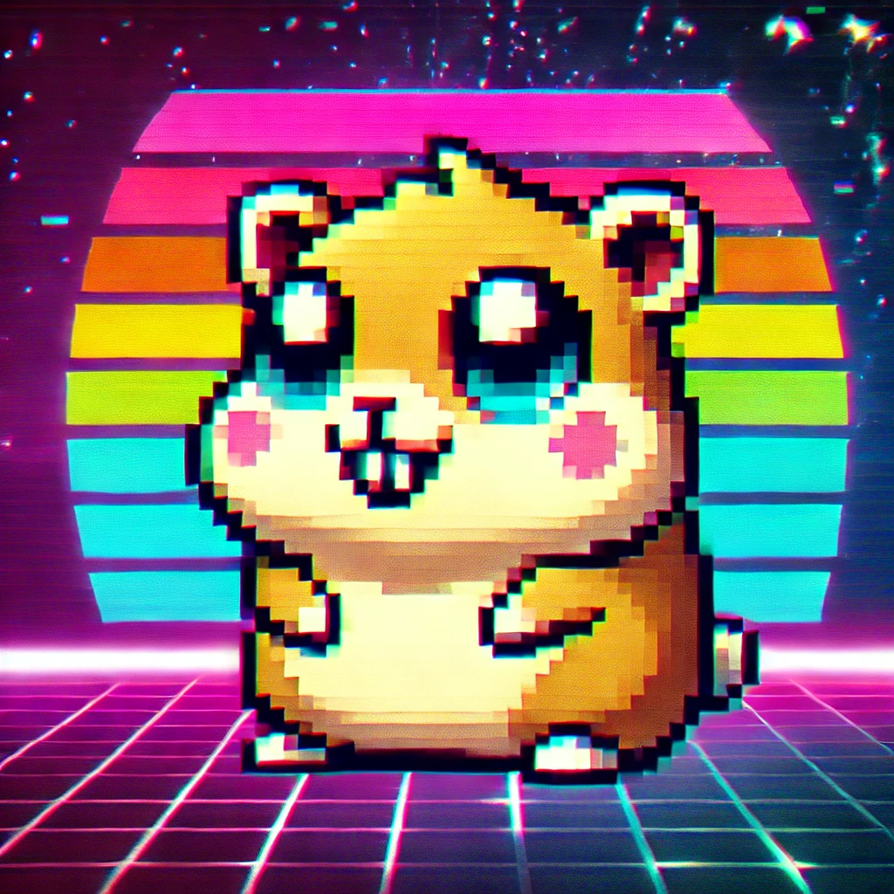

<table style="width:100%" align="center" border="0">
  <tr align="center">
    <td></td>
    <td><h1>🎥 ＣｉｎｅＷｉｎｘ 📼</h1></td>
  </tr>
</table>

  <strong>An open-source API for index and stream movies and series using <a href="https://t.me/cinewinxy">CineWinx</a> channel.</strong>

  
  
  
  
  
  

